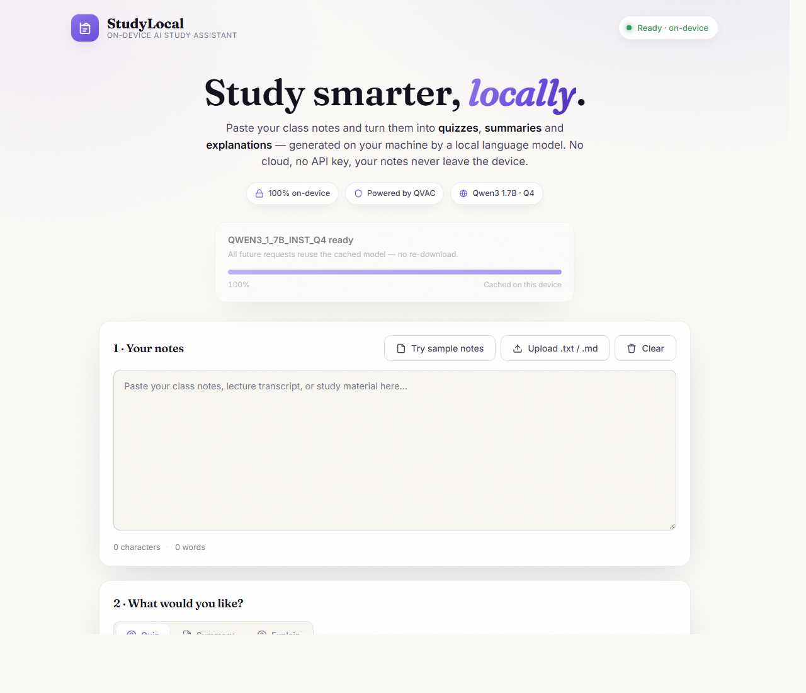
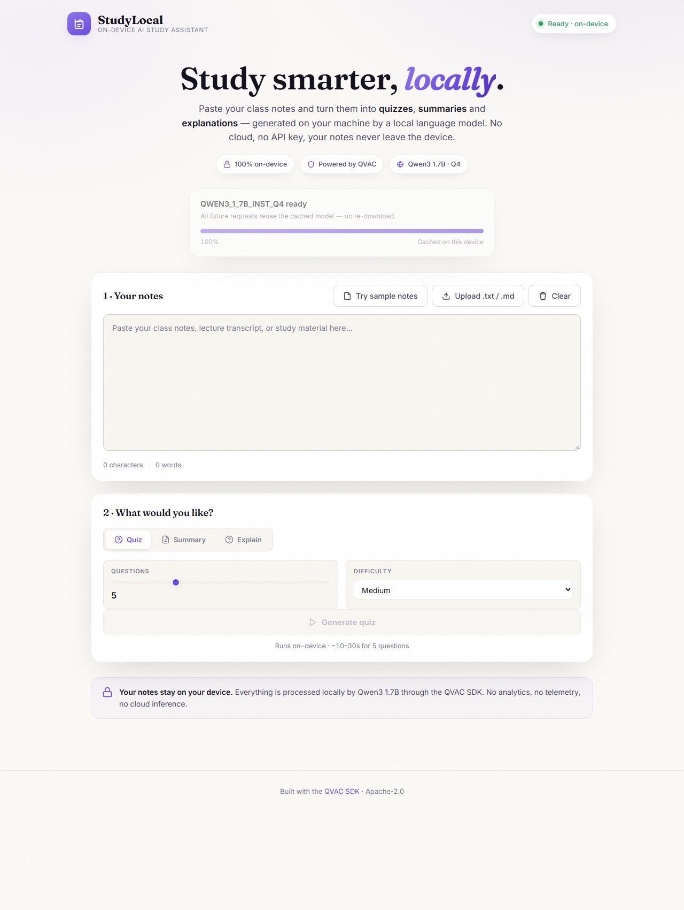

# StudyLocal — On-Device AI Study Assistant

A private, on-device AI study assistant powered by the QVAC SDK and Qwen3 1.7B. Paste or upload your notes and get multiple-choice quizzes, structured summaries, and grounded explanations — all generated locally on your machine. Nothing is uploaded, no API keys, no cloud.





---

## License

Apache-2.0

---

## Checklist

- [x] Uses `@qvac/sdk` (v0.19.1)
- [x] All inference runs on-device — no cloud, no API keys
- [x] Model downloaded once via `loadModel` with live progress
- [x] Uses `completion` for quiz, summary, and explain generation
- [x] Uses `close` for graceful shutdown
- [x] Polished, responsive web UI
- [x] Works fully offline after first model download
- [x] Clean git history with descriptive commits
- [x] README with run instructions

---

## About the app

**StudyLocal** turns your own notes into interactive study material using a local LLM. Three modes:

| Mode | What it does |
|---|---|
| **Quiz** | Generates multiple-choice questions grounded in your notes, with correct answers and explanations. Interactive scoring in the browser. |
| **Summary** | Produces a faithful summary at short / medium / long length — only facts from your notes, never invented. |
| **Explain** | Ask a question about your notes and get a tutor-style answer that cites the relevant section. |

The model (Qwen3 1.7B, Q4 quantised, ~1 GB) is downloaded once on first launch and cached locally. All subsequent runs are fully offline. A live progress bar shows download status via Server-Sent Events.

### Privacy

Your notes are never sent anywhere. The Express server runs on `localhost:3000`, the QVAC SDK spawns a local worker process, and all inference happens on your CPU. Close the server and nothing is running.

---

## QVAC functions used

| Function | Where |
|---|---|
| `loadModel` | `server.js` — downloads and loads Qwen3 1.7B with `onProgress` callback for live download tracking |
| `completion` | `server.js` — `runCompletion()` calls the on-device LLM for quiz, summary, and explain endpoints |
| `close` | `server.js` — graceful shutdown on SIGINT / SIGTERM |
| `QWEN3_1_7B_INST_Q4` | `server.js` — built-in model descriptor for the Qwen3 1.7B instruct model |

---

## Requirements

- **Node.js** >= 18
- **Windows x64** (for `bare-runtime-win32-x64`)
- ~1 GB disk for the model (downloaded once on first run)
- No GPU required — runs on CPU

---

## Run locally

```bash
# 1. Clone the repo
git clone https://github.com/your-username/study-local-ai.git
cd study-local-ai

# 2. Install dependencies (includes the QVAC SDK + bare runtime)
npm install

# 3. Start the server
npm start

# 4. Open in your browser
# → http://localhost:3000
```

The first launch downloads the Qwen3 1.7B model (~1 GB). A progress bar in the UI shows the download status. Once ready, you can start generating quizzes immediately.

### Dev mode (auto-restart on changes)

```bash
npm run dev
```

---

## Suggested X post

```
Built StudyLocal — a fully on-device AI study assistant using @qaboradqvac

Paste your notes → get quizzes, summaries & explanations.
No cloud. No API keys. Qwen3 1.7B runs locally via the QVAC SDK.

~1 GB model, works offline after first download.

#QVAC #LocalAI #BuildInPublic
```
